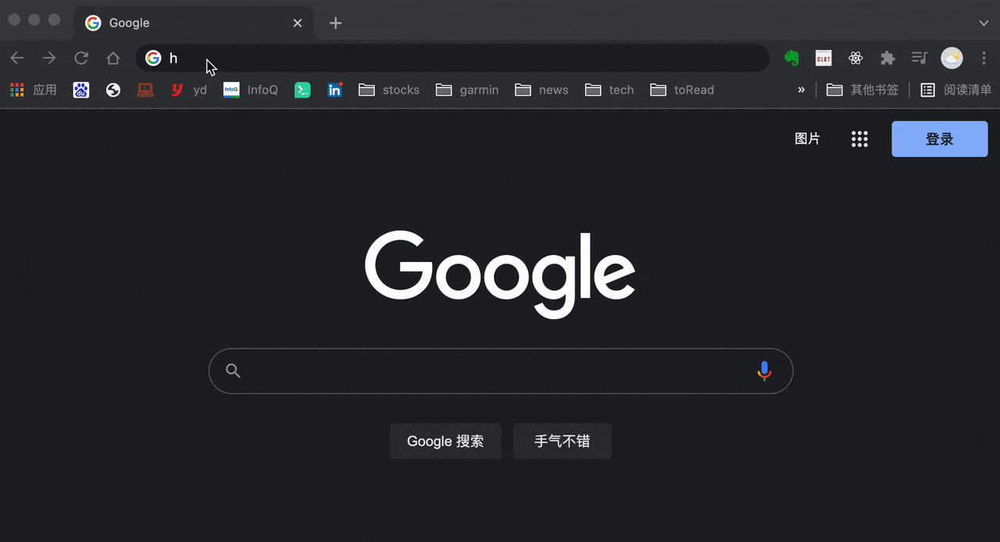
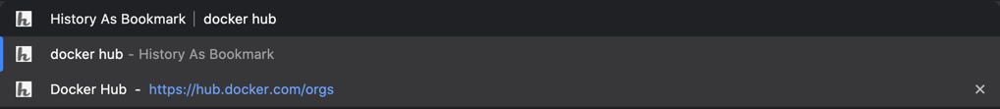

# History-As-Bookmark

This [history-as-bookmark](https://github.com/gaoqing/history-as-bookmark) is a browser extension, manage your browsing history and make their URLs available for your searching in address bar.

Note that browser itself only keep browsing history in a period of time, however while user typing in address bar, historical URLs sometimes not well pop up to give suggestion, so user may need to bookmark them beforehand or go into dedicated history page to search out to revisit

The extension, will automatically save your browsing history into [IndexedDB](https://developer.mozilla.org/en-US/docs/Web/API/IndexedDB_API) and build up a history store going forward in a persistent way, additionally it will back them up under browser's bookmark manager too.

So with this, you don't need to manually bookmark those URLs, history now become your bookmarks!

Make it very handy for your searching in address bar and re-visiting them.

### Browser supports
Chrome and Firefox

### Install
##### It is deployed in Chrome web store, can install directly from there (https://chrome.google.com/webstore/detail/history-as-bookmark/mfbdcpljldfodjopfhbafaipgmfgalbl)
OR,  locally you can clone this codebase, then install and try by below steps:

* In Chrome: Open the chrome://extensions page, click load unpacked, and then select the folder in which the manifest.json file exists.
* In Firefox: Open the about:debugging page, click "This Firefox" (in newer versions of Firefox), click "Load Temporary Add-on", then select any file in the extension's directory.

Wait for a short while after installation for indexing, then will be good to go.

### Usage
In address bar:  
 * For chrome: type letter 'h' followed by [Tab keystroke] or [Space keystroke]
 * For firefox: type letter 'h' followed by [Space keystroke]

Then you can start typing your searching keywords, browser will forward your keywords to this extension to handle, which is to search against your browsing history from local indexedDB records.
Those matched URLs will be showed up in dropdown list, depends on browser setting, couples of suggestion result will be provided, in URLs' visited count descending order. Input more keywords separated by space to do more precise searching. 

Also, since your history has been included into bookmark manager too, you can directly type keyword in address bar without using h+Tab/Space way, that will fall into browser default bookmarks searching and ordering logic.

 
NOTE: If you don't want to see a particular URL from suggestion list, you can delete it by hovering and clicking delete icon at the end of the URL(chrome only feature).

 
